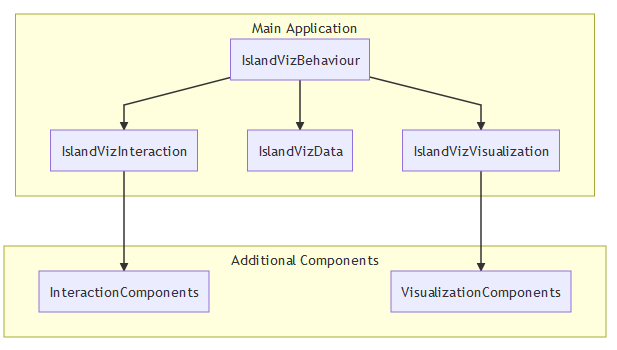
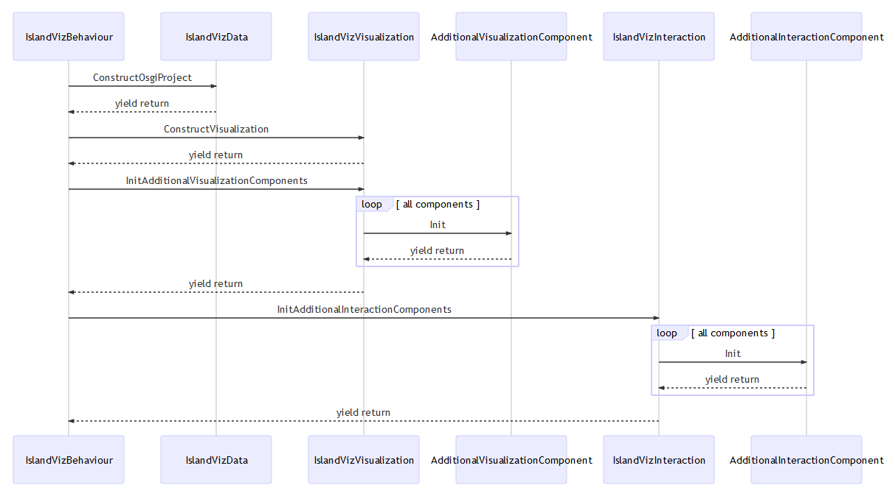

**<h1>IslandViz Virtual Reality</h1>**

> Unity 2019.3.0f1

> Please note that the __revised branch__ is an experimental branch. As such, there is no support offered and features may be incomplete, broken or removed in the future!

---

IslandViz is a software visualization tool which represents the architecture of OSGi-based software systems in virtual reality. Using an island metaphor, each module is represented as an independent island. The resulting island system is displayed on a virtual table where users can interact with the visualization and explore the island system. IslandViz allows users to get an initial overview of the complexity of a software system by examining the modules and their dependencies.

---

## Getting Started

1. Clone the IslandViz repo recursively.

> git clone --recurse-submodules https://github.com/DLR-SC/island-viz.git

2. Remove the Microsoft.Contracts.dll at quickgraph4unity/src/Assets/quickgraph4unity/Dependencies/CodeContracts (Silverlight)/ .

3. Open the project in Unity.

---

## Importing a OSGi-based Software Systems

The IslandViz can currently import a software system either as a Json file or by connecting to a Neo4J server. 

>More infos to come ...

---

## Controls

| Button | User-Action | Result                                     |
|--------|-------------|--------------------------------------------|
| 1      | PRESS       | Undo last Action                           |
| 2      | TOUCH       | RaycastSelection: Highlight                |
| 2      | PRESS       | RaycastSelection: Select                   |
| 3      | PRESS       | TableHeightAdjuster; InverseMultiTouchInput|
| 4      | PRESS       | Screenshot                                 |

>More infos to come ...

---

## For Developers

This revised branch is currently not targeted at developers, as things are going to change a lot. However, if you still want to customize the IslandViz or work on your own tool, here are some helpful information:  

>Note that this only applies to the revised branch! The main branch currently has another architecture.

The IslandViz application consists of three basic parts: 

- __IslandVizData__ imports the software data (either from a Json or a Neo4J server) and converts the data to a Osgi project.
- __IslandVizVisualization__ creates and stores the islands and ports based on the Osgi project. Also handles all visualization-based events.
- __IslandVizInteraction__ handles all user input events.

New interactions or visualizations can easily be added by writing __Additional Components__. As seen in the sequence diagram, after the basic build routine is done, additional components are loaded. Current Additional components are e.g. TableHeightAdjuster.cs or Compass.cs. To enable a additional component you just have to add the script to the corresponding _component container_ GameObject in the Unity scene. 

>More infos to come ...

---

## Dependencies
JsonObject, QuickGraph4Unity, SteamVR, Triangle.NET C# port.

> All of these are included as sub-modules and are obtained automatically when the IslandViz repo is cloned recursively.
